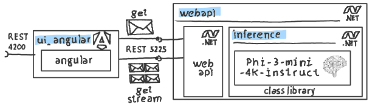
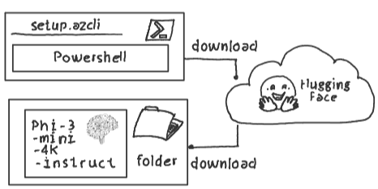

# .NET | Small Language Models | ONNX Runtime

## Repo Content

This repo highlights how to power a simple .NET web API application with a Phi-3 model.

This is ideal for AI applications that need to be executed on-premise, in restricted, or bandwidth-limited environments.



1. **.NET Class Library with Phi-3 Model (inference)**: The [.net class library](./src/inference/) highlights how to power a simple .NET class library with a small language model (Phi-3-mini-4k-instruct). The used [ONNX Runtime](https://github.com/microsoft/onnxruntime) is a high-performance inference engine enabling developers to run and include machine learning models across various platforms.

2. **.NET Web API (webapi)**: The [.NET Web API project](./src/webapi/) utilizes the aforementioned .NET class library to access the SLM inference endpoint through standard HTTP requests. Ensure that the webapi is providing it's REST endpoint on Port 5225. Set the env variable `ASPNETCORE_URLS = "http://localhost:5225"` if necesseary. 

3. **Angular Frontend (ui_angular)**: The [angular based ui project](./src/ui_angular/) provides a frontend application that interacts with the .NET web API. It demonstrates how to use streaming and default inference endpoints. Ensure that you have [node.js](https://nodejs.org/) and the [angular cli](npm install -g @angular/cli) installed. Execute `npm install` and `ng serve` to start the angular front end and point your browser to `http://localhost:4200`  

4. **Configuration and Setup Scripts**: The [powershell script](./setup/setup.azcli) contains all necessary steps for setting up the environment and downloads the Phi-3 model from Hugging Face.

## Configuration

The [powershell script setup.azcli](./setup/setup.azcli) downloads the ONNX runtime optimized version of [Phi-3-mini-4k-instruct](https://huggingface.co/microsoft/Phi-3-mini-4k-instruct-onnx) and stores it in a local folder accessible by the [inference class library project](./src/inference/).



[./config](./config) must contain a file `config.env` with `SLM_MODELPATH` pointing to the download folder of your SLM. E.g.:

```azurepowershell
SLM_MODELPATH = C:/models/slm/Phi-3-mini-4k-instruct-onnx/cpu_and_mobile/cpu-int4-rtn-block-32-acc-level-4
```

## Fine Tuning

This repository uses the default Phi-3 model to demonstrate the integration of Small Language Models (SLMs) with .NET applications.

Given the simplicity and efficiency of fine-tuning small language models, developers can also host fine-tuned models using the ONNX Runtime, allowing for customized AI solutions tailored to specific needs while maintaining high performance and cross-platform compatibility.